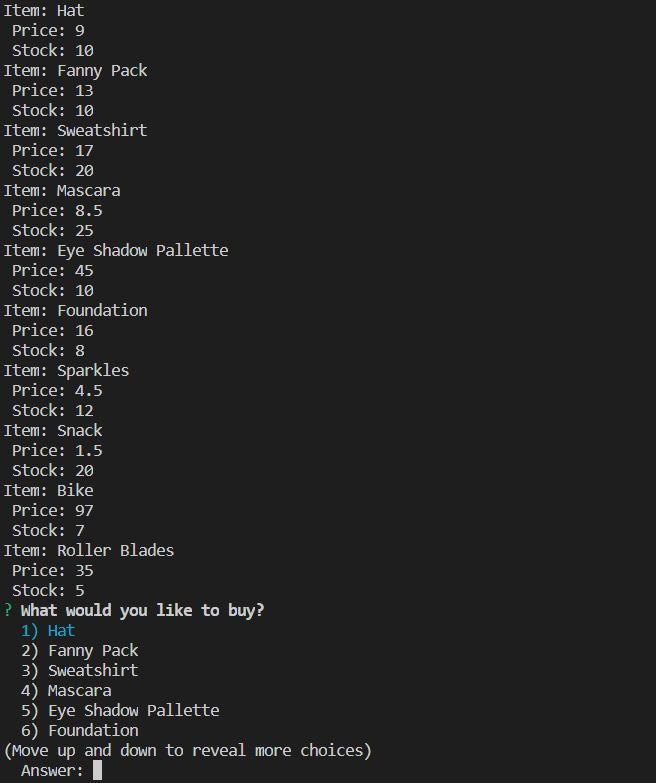
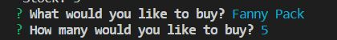
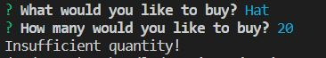
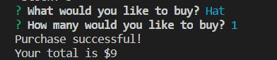

# bamazon
# Node.js & MySQL

## What is this app?

This is an Amazon-like storefront with MySQL. The app will take in orders from customers and deplete stock from the store's inventory. 

## How does it work?

1. There is a MySQL Database called `bamazon`.A Table inside of that database is called `products`.

2. The products table should have each of the following columns:

   * item_id (unique id for each product)

   * product_name (Name of product)

   * department_name

   * price (cost to customer)

   * stock_quantity (how much of the product is available in stores)

3. A Node application called `bamazonCustomer.js` will first display all of the items available for sale. Including the ids, names, and prices of products for sale.

4. The app should then prompt users with two messages.

   * The first should ask them the ID of the product they would like to buy.
   * The second message should ask how many units of the product they would like to buy.

5. Once the customer has placed the order, the application should check if your store has enough of the product to meet the customer's request.

   * If not, the app should log a phrase like `Insufficient quantity!`, and then prevent the order from going through.

6. However, if the store _does_ have enough of the product, it should fulfill the customer's order.
   * This means updating the SQL database to reflect the remaining quantity.
   * Once the update goes through, the customer sees the total cost of their purchase.

## What is this database for, who will use it?

* This is for classwork Node.js & MySQL but anyone is welcome to look at the code

